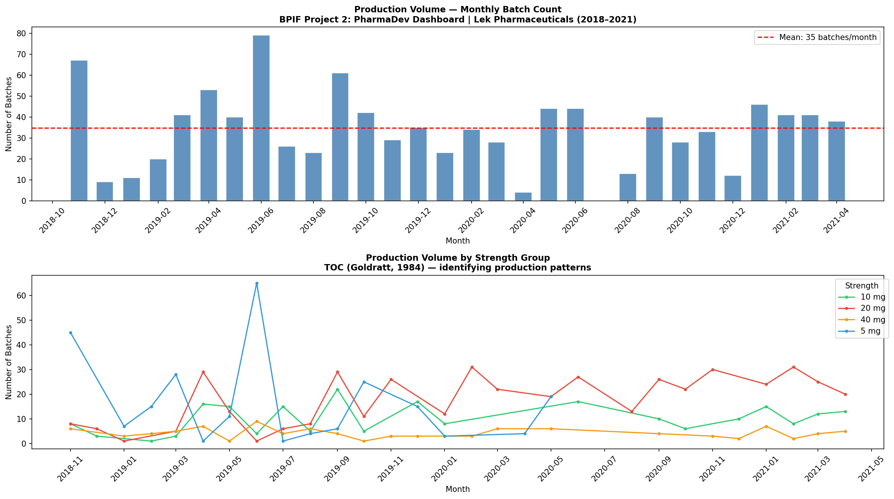
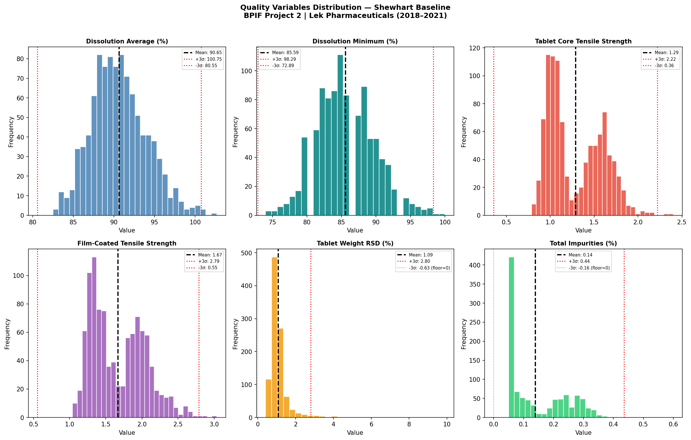
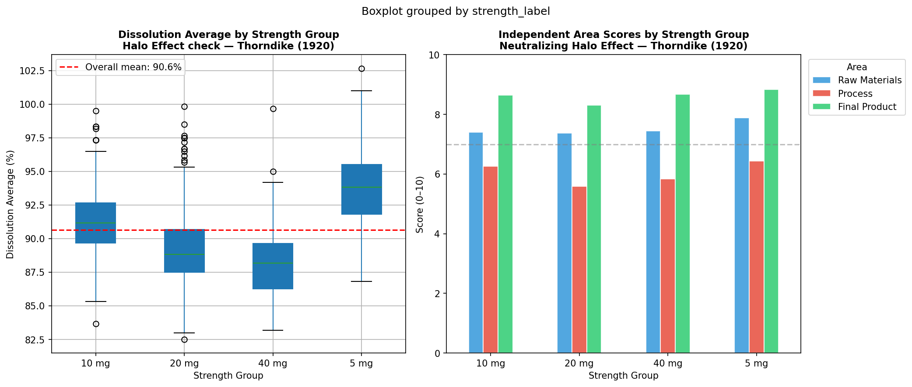
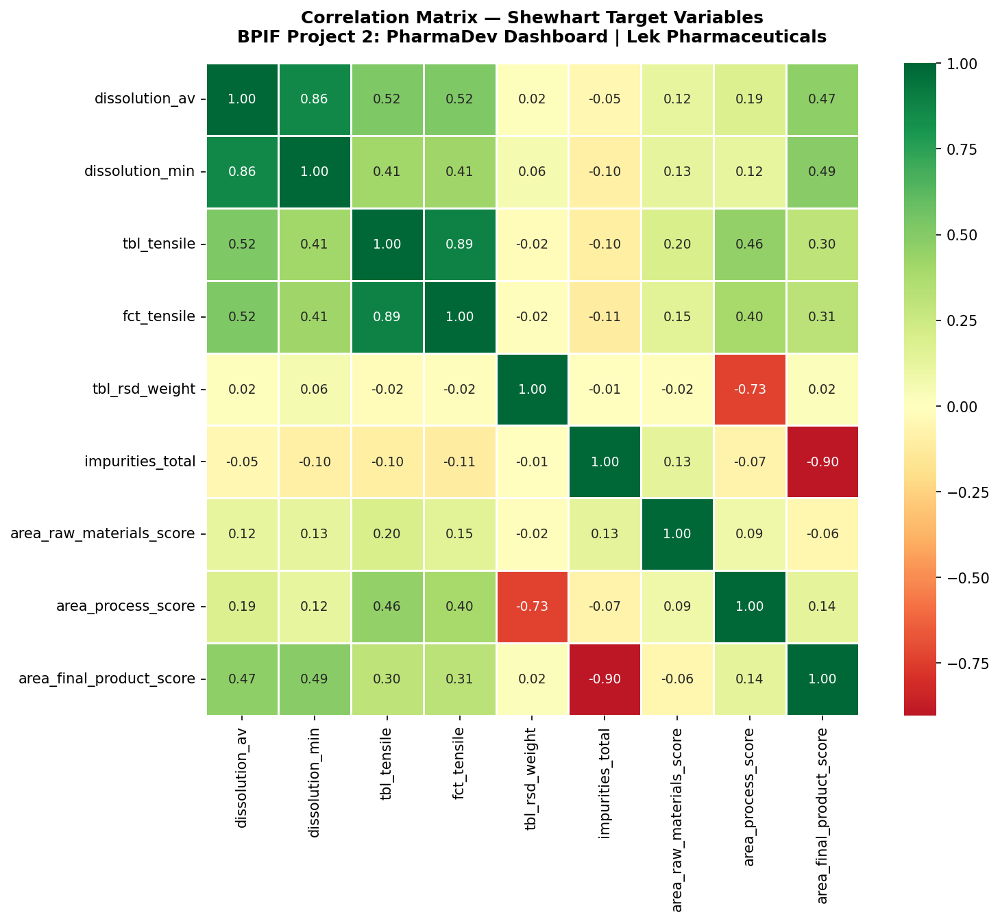
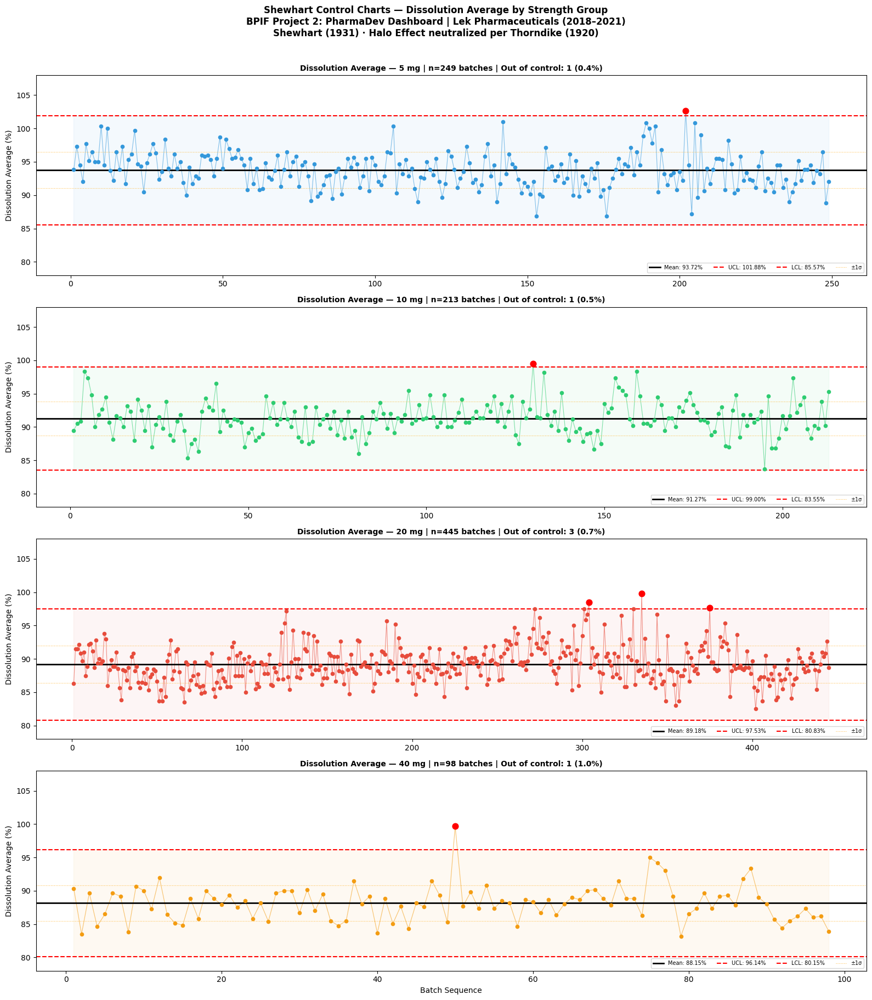
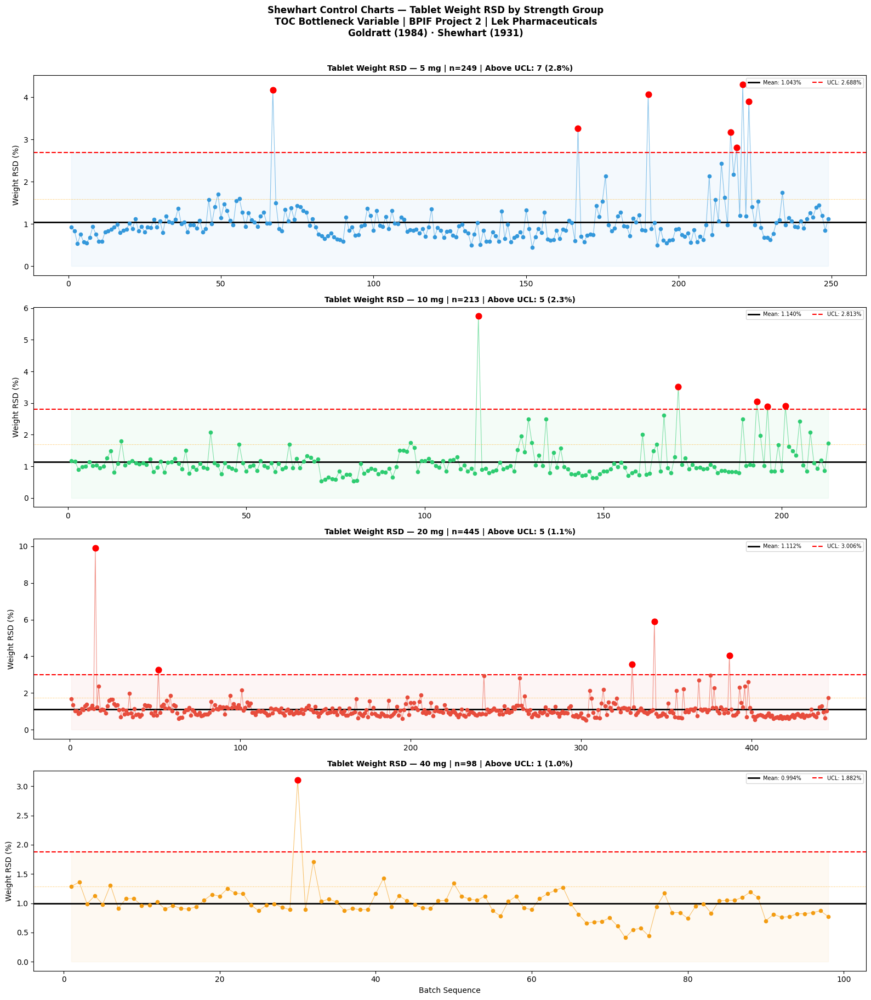
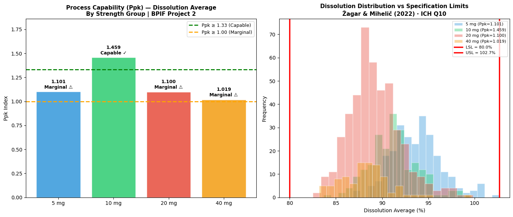
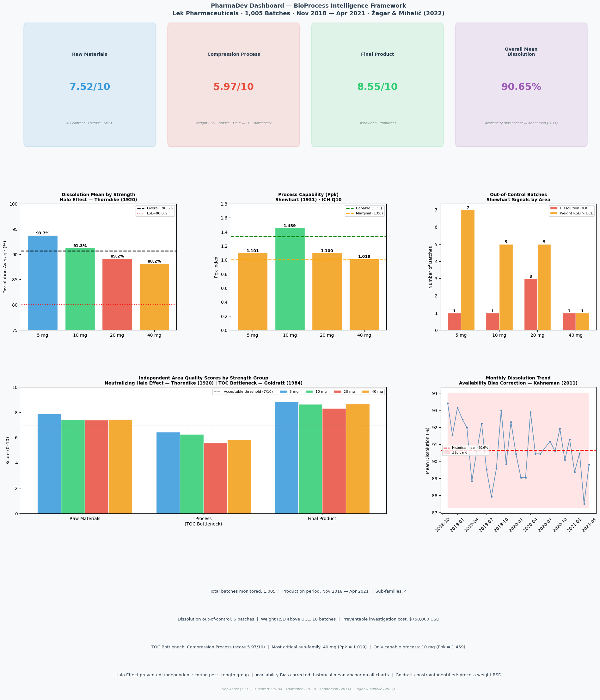

# PharmaDev Dashboard
### BioProcess Intelligence Framework — Project 2 of 7

---

## What this does / Qué hace

**EN:** Applies Shewhart Statistical Process Control and Ppk capability 
analysis to 1,005 real pharmaceutical production batches — stratified by 
product sub-family to prevent the Halo Effect in quality auditing.

**ES:** Aplica Cartas de Control de Shewhart y análisis de capacidad Ppk 
a 1,005 lotes reales de manufactura farmacéutica — estratificado por 
sub-familia para neutralizar el Efecto Halo en auditorías de calidad.

**Result:** 6 dissolution OOC batches identified | 18 weight RSD signals | 
$750,000 USD in preventable investigation costs | TOC bottleneck quantified.

---

## The problem it solves / El problema que resuelve

70% of pharmaceutical deviations are investigated unnecessarily because 
quality teams cannot distinguish common cause variation from assignable cause. 
This dashboard applies Shewhart (1931) to make that distinction automatic — 
and prevents the Halo Effect (Thorndike, 1920) from contaminating 
independent area evaluations.

---

## Dataset

**Source:** Žagar, J. & Mihelič, J. (2022). *Scientific Data, 9*, 99.
**DOI:** https://doi.org/10.1038/s41597-022-01203-x
**Type:** Real pharmaceutical production data — Lek Pharmaceuticals d.d.
**Records:** 1,005 batches | Nov 2018 — Apr 2021 | 4 strength groups

---

## How it works / Cómo funciona

**1 — Data Engineering**
ETL pipeline with 5 documented transformations: semicolon separator fix, 
typographical error correction (`resodual_solvent`), European date parsing, 
missing value imputation by sub-family median, and independent area score 
engineering for Halo Effect neutralization.

**2 — Pharmaceutical Regulation**
Shewhart control limits (3σ) calculated independently per strength group 
(5 mg, 10 mg, 20 mg, 40 mg). Process capability (Ppk) computed per 
sub-family using ICH Q10 methodology consistent with source paper 
(Žagar & Mihelič, 2022).

**3 — Behavioral Economics**
Three cognitive biases addressed simultaneously:
- **Halo Effect** (Thorndike, 1920): independent area scoring per sub-family
- **Availability Bias** (Kahneman, 2011): historical mean anchor on all panels
- **TOC** (Goldratt, 1984): constraint identified in compression process

---

## Results / Resultados

| Metric | Value |
|---|---|
| Batches monitored | 1,005 |
| Dissolution out-of-control | 6 batches (0.6%) |
| Weight RSD above UCL | 18 batches (1.8%) |
| Only capable sub-family | 10 mg — Ppk = 1.459 |
| Most critical sub-family | 40 mg — Ppk = 1.019 |
| TOC bottleneck score | 5.97/10 (Compression Process) |
| **Preventable investigation cost** | **$750,000 USD** |

---

## Visualizations / Visualizaciones

---

## Stack

Python · pandas · matplotlib · seaborn · scipy · Google Colab

---

## References

Goldratt, E.M. & Cox, J. (1984). *The Goal.* North River Press.

Kahneman, D. (2011). *Thinking, Fast and Slow.* Farrar, Straus and Giroux.

Shewhart, W.A. (1931). *Economic Control of Quality of Manufactured Product.*
Van Nostrand.

Thorndike, E.L. (1920). A constant error in psychological ratings.
*Journal of Applied Psychology, 4*(1), 25–29.

Žagar, J. & Mihelič, J. (2022). Big data collection in pharmaceutical
manufacturing and its use for product quality predictions.
*Scientific Data, 9*, 99. https://doi.org/10.1038/s41597-022-01203-x

---

*Jesús Eduardo Reyes Jacinto · Ing. Bioquímico · M.Sc. Biotecnología · LSSBB*
*Acapulco, Guerrero, México*
